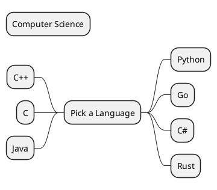
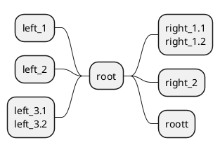
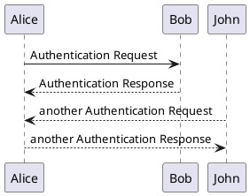

# testingPlantuml

``` plantuml
@startmindmap
+ Computer Science

+ Pick a Language

++ Python
++ Go
++ C#
++ Rust

-- C++
-- C
-- Java
@endmindmap
```

``` plantuml
@startmindmap
+ root
**:right_1.1
right_1.2;
++ right_2

left side

-- left_1
-- left_2
**:left_3.1
left_3.2;

++ roott
@endmindmap
```

``` plantuml
@startuml
' this is a comment
Alice -> Bob: Authentication Request
Bob --> Alice: Authentication Response
John --> Alice: another Authentication Request
Alice --> John: another Authentication Response
@enduml
```

./test.png

*test.png*

 
